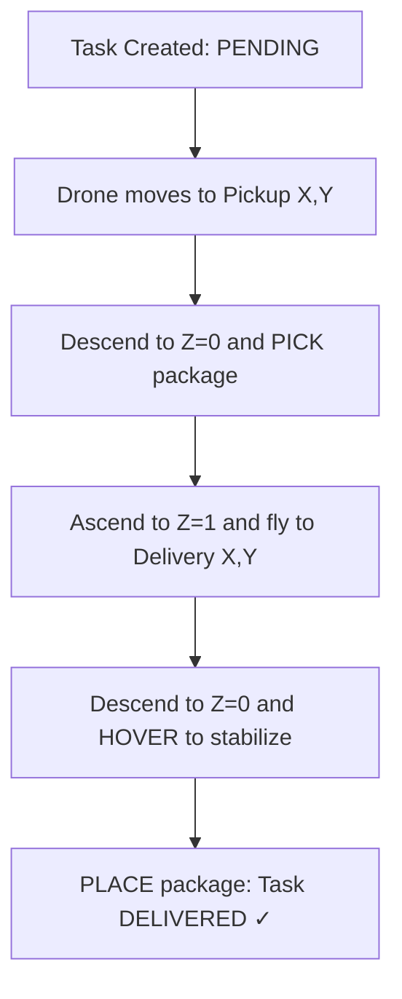

# Drone-env

An [OpenEnv](https://huggingface.co/openenv)-compliant environment that simulates a **real-world warehouse-to-doorstep drone delivery pipeline**. Autonomous drones pick packages directly from warehouse shelves, fly through a 3D grid with altitude layers and wind physics, and deliver to customer locations.

---

## Repository layout

High-level tree (source only; omit local `venv/`, `__pycache__/`, and secrets):

```text
Hack-Forge/
├── app.py                 # Thin entry: imports FastAPI `app` from `server.app` (run with uvicorn)
├── client.py              # Async HTTP + WebSocket client (`DroneEnv`) for talking to a deployed Space/API
├── inference.py           # Baseline agent script (LLM-driven control against the API)
├── openenv.yaml           # OpenEnv manifest: task metadata, observation/action schema, API surface
├── pyproject.toml         # Project metadata and tooling (packages include env, tasks, grader)
├── requirements.txt       # Pip dependencies (used by Dockerfile)
├── uv.lock                # Locked dependency versions for uv
├── Dockerfile             # Container image; runs `uvicorn server.app:app` on port 7860
├── validate-submission.sh # Helper script for submission / validation workflows
├── README.md
├── env/                   # Core simulation: grid, agents, physics, rewards, `reset` / `step` / `state`
│   ├── drone_env.py       # `DroneEnv` implementation (main environment loop)
│   └── models.py          # Pydantic models: actions, observations, task/drone state, enums
├── tasks/                 # Per-difficulty **task configs** passed into `DroneEnv` (grid, drones, tasks, limits)
│   ├── easy.py            # `get_config()` for easy scenario
│   ├── medium.py          # `get_config()` for medium scenario
│   └── hard.py            # `get_config()` for hard scenario
├── grader/                # Final **evaluation score** in [0, 1] from a terminal `state` dict
│   ├── grader.py          # Unified `grade()` + `detailed_report()` + `GRADE_PARAMS` (used by the server)
│   ├── easy.py            # Standalone grader mirror for easy (same math, fixed weights)
│   ├── medium.py          # Standalone grader mirror for medium
│   └── hard.py            # Standalone grader mirror for hard
├── server/                # **HTTP API** layer (FastAPI): `/reset`, `/step`, `/grade`, `/metrics`, `/ws`, `/web`
│   └── app.py             # Routes, task registry, WebSocket stream, minimal dashboard HTML at `/web`
└── tests/                 # Automated checks for env + grader behavior
    └── test_env.py        # Tests reward/grader integration and env invariants
```

| Location | Role |
|----------|------|
| **`env/`** | All in-world logic: stepping the simulation, collisions, battery, tasks, and building observations. |
| **`tasks/`** | Data-only (Python dict) scenarios: how many drones, map size, obstacles, `max_steps`, and delivery tasks. |
| **`grader/`** | Maps a post-episode `state` to a scalar score and an optional breakdown report (separate from per-step RL reward). |
| **`server/`** | Exposes the env over REST and WebSocket so agents (or `client.py`) can run without importing `DroneEnv` locally. |
| **`client.py`** | Reference remote client for the same protocol your own agents would use against a URL. |
| **`inference.py`** | Example end-to-end loop: reset → many steps → print grading report (good template for custom agents). |
| **`openenv.yaml`** | Machine-readable spec for OpenEnv tooling (`openenv validate`) and external integrations. |

---

## Technical Concept: Drone-Only Logistics

Drone-env focuses on the **Urban Air Mobility (UAM)** challenge:
- **Top-Down Coordinate System**: 
  - (0,0) is Top-Left.
  - **SOUTH increases Y** (Down on grid).
  - **EAST increases X** (Right on grid).
- **Altitude Layers**: Drones cruise at $Z=1$ to avoid obstacles and descend to $Z=0$ only for **PICK** and **PLACE**.
- **Physics-Informed Rewards**: Drones are penalized for instability, near-misses, and battery depletion, while being rewarded for efficient delivery and smooth handling.

---

## Delivery Pipeline



---

## Reward Engine & Scoring

Drone-env provides **Meaningful Rewards** with dense partial progress signals:

| Event | Reward | Description |
|---|---|---|
| **Delivery** | `+1000.0` | Task successfully completed at doorstep. |
| **Pickup** | `+200.0` | Significant credit for successful shelf retrieval. |
| **Collision** | `-1000.0` | Major penalty (immediate mission failure logic). |
| **Step Penalty**| `-0.5` | Encourages speed and efficiency. |
| **Idle Penalty**| `-1.0` | Discourages wasting battery on the ground. |

---

## Episode loop: reset, step, and grade

The server follows the standard OpenEnv pattern: you **reset** a task, **step** with actions until the episode ends (or you stop), then **grade** the final state. Per-step values in `observation.reward` are for learning signals; the **grade** is a separate $[0,1]$ score used for evaluation and leaderboards.

### Reset (`POST /reset`)

- **Body**: `{ "task_name": "easy" | "medium" | "hard" }` (defaults to `easy` if omitted or invalid JSON).
- **Effect**: Creates a fresh `DroneEnv` from the task config (`tasks/easy.py`, `tasks/medium.py`, `tasks/hard.py`), then runs `reset()` internally.
- **What reset clears and rebuilds**: episode step counter to `0`, collision and battery-failure counters, robots and drones from the config (positions, batteries, flight/diagnostics), all delivery tasks and the dispatch queue, and related episode buffers.
- **Returns**: An `AeroSyncObservation` for the initial state (mission layout, agents, tasks, `step`, `max_steps`, etc.).

You must call reset before `POST /step`, `GET /state`, `GET /grade`, or `GET /metrics`; otherwise the API responds with an error asking you to reset first.

### Step (`POST /step`)

- **Body**: An `AeroSyncAction` JSON (for example `agent_id`, `action_type`, optional `direction`, `task_id`, waypoints, etc.).
- **Effect**: The environment increments the global episode step counter, applies the action to the named robot or drone, updates physics and task state, and accumulates rewards and diagnostics (collisions, near-misses, forced RTB, battery events, and so on).
- **Returns**: `observation`, scalar `reward` for that transition, boolean `done`, and `info` (structured episode details).

The episode may terminate when all tasks are finished, time runs out (`step >= max_steps`), or other failure conditions defined in the environment. You can still call `GET /grade` afterward to score the terminal state.

### Grade (`GET /grade`)

- **Input**: No body; grading uses the **current** full environment state from `env.state()` after your steps.
- **Returns**: `score` in $[0.0, 1.0]$ and a `report` dictionary from `detailed_report()` (completion counts, safety metrics, drone-quality breakdown, and the same `final_score`).

Grading is **deterministic** given the final state: same state dict always yields the same score.

---

## Grader system (how the final score is computed)

Implementation lives in `grader/grader.py`. The function `grade(state)` reads `task_name` from the state and selects **weights** from `GRADE_PARAMS` for that difficulty. It then combines five terms:

| Component | Meaning | How it is derived |
|-----------|---------|-------------------|
| **Completion** | Fraction of tasks delivered | Count of tasks with status `delivered` divided by total tasks. |
| **Efficiency** | Time use vs. horizon | $\max\bigl(0,\ 1 - \frac{\texttt{step}}{\texttt{max\_steps}} \times 0.5\bigr)$ (more steps lower this term; it is floored at $0$; at `step == max_steps` the factor inside the max is $0.5$). |
| **Safety** | Penalties for incidents | Starts at $1.0$, then subtracts weighted counts: collisions ($0.10$ each), battery failures ($0.15$ each), forced RTB events summed from drone diagnostics ($0.05$ each), obstacle near-miss counts ($0.03$ each). Result is clamped to $[0, 1]$. |
| **Priority** | Important deliveries | Among **delivered** tasks only: average of $\texttt{priority}/3$ (priorities are capped at $3$ in the normalization). |
| **Drone quality** | Smooth, healthy operation | Score in $[0,1]$ from drone diagnostics: caps on deductions for near-misses and forced RTB, extra penalty if average motor health falls below $0.8$, hover stability below $0.7$, and failed place attempts vs. successful deliveries. |

**Weighted sum** (then clamped to $[0, 1]$ and rounded to four decimals):

$$\texttt{score} = w_c \cdot \texttt{completion} + w_e \cdot \texttt{efficiency} + w_s \cdot \texttt{safety} + w_p \cdot \texttt{priority} + w_d \cdot \texttt{drone\_quality}$$

**Per-task weights** (`completion`, `efficiency`, `safety`, `priority`, `drone_quality`):

| Task | Completion | Efficiency | Safety | Priority | Drone quality |
|------|------------|------------|--------|----------|---------------|
| easy | 0.60 | 0.15 | 0.10 | 0.05 | 0.10 |
| medium | 0.45 | 0.18 | 0.17 | 0.10 | 0.10 |
| hard | 0.35 | 0.18 | 0.22 | 0.15 | 0.10 |

Task-specific modules `grader/easy.py`, `grader/medium.py`, and `grader/hard.py` mirror the same logic with fixed weights; the HTTP server uses the unified `grader.grader.grade` / `detailed_report` API so one code path handles all difficulties via `state["task_name"]`.

### Detailed grading report

`detailed_report(state)` adds human-readable fields on top of the scalar score, including steps used, max steps, per-task statuses, collision and battery failure counts, forced RTB and near-miss totals, average motor health and hover stability, delivery vs. failed-drop counts, and the computed `drone_quality_score`. Use it to debug **why** a run scored high or low.

---

## 🚀 Quick Start: Standard OpenEnv Access

Drone-env supports the standard OpenEnv protocol for both synchronous and asynchronous agent interaction.

### 📦 Installation
Install the client package directly from this Space:
```bash
pip install git+https://huggingface.co/spaces/abhinayychaudharyy/aerosync-ai
```

### 🤖 Basic Usage (Python Client)
```python
import asyncio
from client import DroneEnv, AeroSyncAction

async def main():
    # 1. Connect to the Space (Async)
    async with DroneEnv(base_url="https://abhinayychaudharyy-aerosync-ai.hf.space") as env:
        # 2. Reset the environment
        obs = await env.reset(task_name="easy")
        print(f"Mission Start at Step {obs.step}")
        
        # 3. Step through the mission
        action = AeroSyncAction(agent_id="drone_0", action_type="wait")
        obs, reward, done, info = await env.step(action)
        print(f"Reward: {reward} | Done: {done}")

asyncio.run(main())
```

### 🛰️ Live Dashboard
Visit the **Interactive Dashboard** to see live drone telemetry and mission progress:
- **Web UI**: [https://vj-ai27-hack-forge.hf.space/web](https://vj-ai27-hack-forge.hf.space/web)
- **WebSocket**: `wss://vj-ai27-hack-forge.hf.space/ws` (for high-frequency agents)

---

## 🛠️ API Reference

### 🚀 Launching the Server
The main entry point is the **root `app.py`**. Run it using:

```bash
uvicorn app:app --host 0.0.0.0 --port 7860
```

### 🤖 Running the Baseline Agent
The baseline agent uses LLM-based reasoning to control the fleet:

```bash
export OPENAI_API_KEY=sk-...
python inference.py --task easy --max_steps 120
```

### 🧪 Validation
```bash
openenv validate .
```

---

## License
MIT
