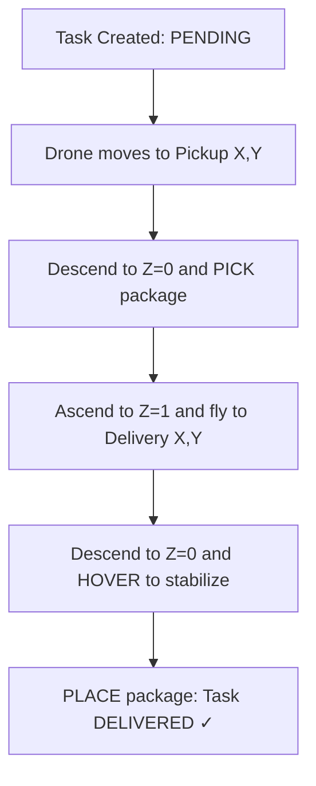

# AeroSync AI

An [OpenEnv](https://huggingface.co/openenv)-compliant environment that simulates a **real-world warehouse-to-doorstep drone delivery pipeline**. Autonomous drones pick packages directly from warehouse shelves, fly through a 3D grid with altitude layers and wind physics, and deliver to customer locations.

---

## Technical Concept: Drone-Only Logistics

AeroSync AI focuses on the **Urban Air Mobility (UAM)** challenge:
- **Top-Down Coordinate System**: 
  - (0,0) is Top-Left.
  - **SOUTH increases Y** (Down on grid).
  - **EAST increases X** (Right on grid).
- **Altitude Layers**: Drones cruise at $Z=1$ to avoid obstacles and descend to $Z=0$ only for **PICK** and **PLACE**.
- **Physics-Informed Rewards**: Drones are penalized for instability, near-misses, and battery depletion, while being rewarded for efficient delivery and smooth handling.

---

## Delivery Pipeline



---

## Reward Engine & Scoring

AeroSync AI provides **Meaningful Rewards** with dense partial progress signals:

| Event | Reward | Description |
|---|---|---|
| **Delivery** | `+1000.0` | Task successfully completed at doorstep. |
| **Pickup** | `+200.0` | Significant credit for successful shelf retrieval. |
| **Collision** | `-1000.0` | Major penalty (immediate mission failure logic). |
| **Step Penalty**| `-0.5` | Encourages speed and efficiency. |
| **Idle Penalty**| `-1.0` | Discourages wasting battery on the ground. |

### Detailed Grading Report
At the end of each episode, the environment generates a **Detailed Grading Report** covering:
- **Efficiency**: Completion speed vs. step budget.
- **Safety**: Near-miss count and collision tracking.
- **Drone Quality**: Hover stability and motor health maintenance.

---

## 🚀 Quick Start: Standard OpenEnv Access

AeroSync AI supports the standard OpenEnv protocol for both synchronous and asynchronous agent interaction.

### 📦 Installation
Install the client package directly from this Space:
```bash
pip install git+https://huggingface.co/spaces/abhinayychaudharyy/aerosync-ai
```

### 🤖 Basic Usage (Python Client)
```python
import asyncio
from client import AeroSyncEnv, AeroSyncAction

async def main():
    # 1. Connect to the Space (Async)
    async with AeroSyncEnv(base_url="https://abhinayychaudharyy-aerosync-ai.hf.space") as env:
        # 2. Reset the environment
        obs = await env.reset(task_name="easy")
        print(f"Mission Start at Step {obs.step}")
        
        # 3. Step through the mission
        action = AeroSyncAction(agent_id="drone_0", action_type="wait")
        obs, reward, done, info = await env.step(action)
        print(f"Reward: {reward} | Done: {done}")

asyncio.run(main())
```

### 🛰️ Live Dashboard
Visit the **Interactive Dashboard** to see live drone telemetry and mission progress:
- **Web UI**: [https://vj-ai27-hack-forge.hf.space/web](https://vj-ai27-hack-forge.hf.space/web)
- **WebSocket**: `wss://vj-ai27-hack-forge.hf.space/ws` (for high-frequency agents)

---

## 🛠️ API Reference

### 🚀 Launching the Server
The main entry point is the **root `app.py`**. Run it using:

```bash
uvicorn app:app --host 0.0.0.0 --port 7860
```

### 🤖 Running the Baseline Agent
The baseline agent uses LLM-based reasoning to control the fleet:

```bash
export OPENAI_API_KEY=sk-...
python inference.py --task easy --max_steps 120
```

### 🧪 Validation
```bash
openenv validate .
```

---

## License
MIT
